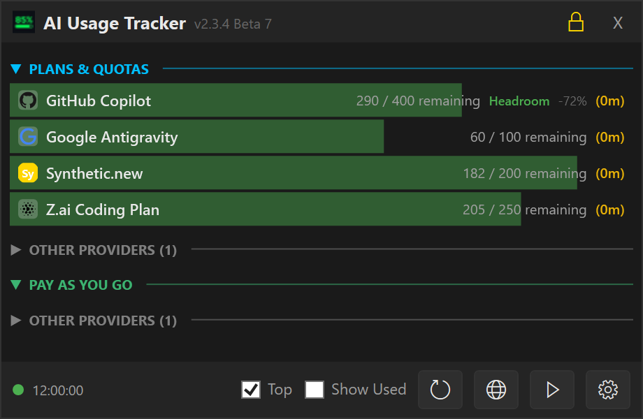
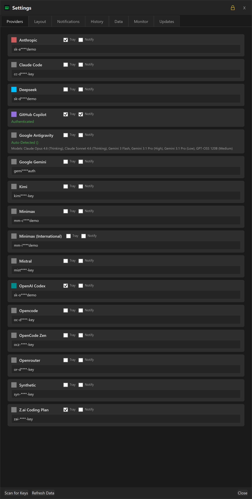

#  AI Usage Tracker

A streamlined Windows dashboard and tray utility to monitor AI API usage, costs, and quotas across multiple providers.

## Support
If you want to support me and are interested in different AI model providers, you can sign up with my referral codes:
- [Z.AI](https://z.ai/subscribe?ic=JQTB1W1M0L): GLM-4.7, GLM-4.6, GLM-4.7-flash
- [synthetic.new](https://synthetic.new/?referral=SNJDbFCgSUZso9E): Minimax M2.1, Kimi K2.5, GLM-4.7, etc.

### Documentation
- [User Manual](docs/user_manual.md)
- [CLI Reference](docs/cli_documentation.md)
- [Architecture & Philosophy](ARCHITECTURE.md)
- [Agent Guidelines](AGENTS.md)

### Community
Join the discussion on our [Discord Server](https://discord.gg/AZtNQtWuJA).

## Download
Download the latest installer or .zip file from the [Release](https://github.com/rygel/AIConsumptionTracker/releases) page.

## Key Features

- **Multi-Provider Support**: Track usage for Anthropic, Gemini, OpenRouter, OpenCode, Kilo Code, DeepSeek, OpenAI, Google Cloud Code, GitHub Copilot, Codex, Mistral, and more.
- **Smart Discovery**: Automatically scans environment variables, Claude Code credentials, and standard configuration files for existing API keys.
- **Auto-Updates**: Notifies you of new releases directly in the dashboard with a one-click download link.
- **Minimalist Dashboard**: A compact, topmost window providing a quick overview of your current spend and token usage.
- **Compact Settings UI**: Streamlined provider cards with 40-50% less vertical space, larger dialog for better visibility.
- **Dynamic Tray Integration**:
  - **Auto-Hide**: Dashboard hides automatically when focus is lost.
  - **Individual Tracking**: Option to spawn separate tray icons for specific providers.
  - **Live Progress Bars**: Tray icons feature "Core Temp" style bars that reflect usage levels in real-time.
- **Inverted Progress Bars**: Default "Health Bar" mode showing **Remaining** capacity (starting green/full) instead of "Used" capacity.
- **Improved DeepSeek Support**: Detailed multi-currency (CNY/USD) balance tracking with official branding.
- **Secure Management**: Manage all keys and preferences through a refined, dark-themed settings menu.

## Supported Providers

| Provider                         | Integration         | Status              | Comment                                                      |
|:---------------------------------|:--------------------|:--------------------|--------------------------------------------------------------|
| **Antigravity**                  | via Antigravity GUI | ✅ Tested            |                                                              |
| **Claude Code**                  |                     | ⚠️ partially tested | Testers welcome                                              |
| **DeepSeek**                     | API Key¹            | ⚠️ Beta             | Testers welcome                                              |
| **Gemini**                       | not integrated yet  | 🚧 Planned          | Testers welcome                                              |
| **GitHub Copilot**               | OAuth Device Flow   | ✅ Tested            |                                                              |
| **Kimi (Moonshot)**              | API Key¹            | ⚠️ Beta             | Testers welcome                                              |
| **Minimax** (China)              | API Key¹            | ⚠️ Beta             | Testers welcome                                              |
| **Minimax** (International)      | API Key¹            | ⚠️ Beta             | Testers welcome                                              |
| **Mistral**                      | API Key¹            | ✅ Tested            | but Mistral does not provide usage information via their API |
| **OpenAI (Codex)**               | via Opencli OAuth   | ️ ⚠️ Beta           | Testers welcome                                              |
| **OpenRouter**                   | not integrated yet  | 🚧 Planned          | Testers welcome                                              |
| **Opencode Zen** (coding plan)   | API Key¹            | ⚠️ Beta             | Testers welcome                                              |
| **Opencode Zen** (pay-as-you-go) | API Key¹            | ✅ Tested            |                                                              |
| **Synthetic**                    | API Key¹            | ✅ Tested            |                                                              |
| **Z.AI** (Coding Plan)           | API Key¹            | ✅ Tested            |                                                              |

¹ API Key can be either entered directly or discovered automatically via opencode configuration  

### Screenshots

**Dashboard (Main Interface)**

**Providers**

For the complete screenshot set (all settings tabs, info dialog, tray states, and context menu), see the [User Manual](docs/user_manual.md).

## Installation

### Manual
1. Download the latest `AIUsageTracker_Setup_v2.1.4.exe` from the [Releases](https://github.com/rygel/AIConsumptionTracker/releases) page.
2. Run the installer.
3. The app will launch and automatically scan for common API keys.

## Configuration & Settings

Access the **Settings** menu by right-clicking the tray icon or using the gear icon on the dashboard.

### Application Settings
- **Show All Providers**: Toggle to show all configured providers, even those with 0 usage or errors.
- **Compact Mode**: Reduces the height of each item, removing the icon and condensing the layout.
- **Pin Window**: Keeps the dashboard open even when focus is lost.
- **Always On Top**: Ensures the dashboard floats above other windows.
- **Invert Progress Bars**: 
    - **Checked**: Bars represent **Remaining** capacity (Start Full/Green -> End Empty/Red).
    - **Unchecked**: Bars represent **Used** capacity (Start Empty -> End Full/Red).
- **Color Thresholds**: Customize the percentage at which bars turn Yellow (Warning) or Red (Critical).
- **Auto Refresh Interval**: 
    - **Minutes**: Set how often (in minutes) the app should automatically check provider APIs for new consumption data.
    - **Disable**: Set to **0** to disable automatic background refreshing.

### Provider Management
- **API Keys**: enter or update specific keys for each provider.
- **Track in Tray**: Check the box next to any provider to add a dedicated icon for it in your system tray.
- **Sub-Quotas**: For complex providers like Antigravity, you can pin specific model quotas to the tray.

## Storage
Configuration is stored in `auth.json` in the application data directory.
- **Automatic Backup**: Your previous configuration is preserved during updates.
- **Secure**: API keys are stored locally.

## License
MIT

