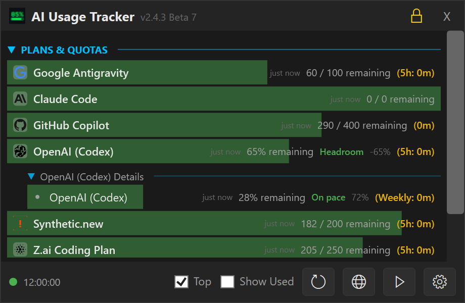

#  AI Usage Tracker


[](https://discord.gg/AZtNQtWuJA)




Windows tray dashboard that tracks AI API usage, quotas, and costs. A loopback Monitor process stores history in SQLite and serves Slim UI, Web UI, and CLI. Publish matrix also builds Monitor/CLI/Web for `linux-x64`, `osx-x64`, and `osx-arm64` (`.github/workflows/publish.yml`); Slim is Windows-only (`net10.0-windows10.0.17763.0`).

**Website:** [aiusagetracker.outerstellar.net](https://aiusagetracker.outerstellar.net/) (`docs/landing/`, `.github/workflows/deploy-landing.yml`)

Version `2.4.7` is `<TrackerVersion>` in `Directory.Build.props`.

## Docs

- [User manual](docs/user_manual.md)
- [CLI](docs/cli_documentation.md)
- [Architecture](docs/ARCHITECTURE.md)
- [Agent rules](AGENTS.md)
- [Index](docs/INDEX.md)

## Install

Download `AIUsageTracker_Setup_v2.4.7_{arch}.exe` from [Releases](https://github.com/rygel/AIUsageTracker/releases) (`scripts/setup.iss` `OutputBaseFilename`, default arch `x64`). Default install dir: `{autopf}\AIUsageTracker`.

## Providers

Implementations live in `AIUsageTracker.Infrastructure/Providers/`:

| Provider | Id | Auth |
|---|---|---|
| Antigravity | `antigravity` | Auto-detected session (`AntigravityProvider`) |
| Anthropic Admin | `anthropic-usage` | `ANTHROPIC_ADMIN_API_KEY` |
| Claude Code | `claude-code` | `ANTHROPIC_API_KEY` / `CLAUDE_API_KEY` |
| Codex | `codex` | `%USERPROFILE%\.codex\auth.json` or `CODEX_API_KEY` |
| DeepSeek | `deepseek` | `DEEPSEEK_API_KEY` |
| Gemini | `gemini-cli` (also `gemini`) | `GEMINI_API_KEY` / `GOOGLE_API_KEY` |
| GitHub Copilot | `github-copilot` | Device/OAuth (`GitHubCopilotProvider`) |
| Grok CLI | `grok` (also `grok-cli`) | `%USERPROFILE%\.grok\auth.json` |
| Groq | `groq` | `GROQ_API_KEY` |
| Kimi | `kimi-for-coding` (also `kimi`) | `KIMI_API_KEY` / `MOONSHOT_API_KEY` |
| MiniMax | `minimax`, `minimax-io`, `minimax-coding-plan` | `MINIMAX_API_KEY`, `MINIMAX_IO_API_KEY`, `MINIMAX_CODING_PLAN_API_KEY` |
| Mistral | `mistral` | `MISTRAL_API_KEY` (status only) |
| OpenAI | `openai` | `OPENAI_API_KEY` |
| OpenCode Go | `opencode-go` | `OPENCODE_API_KEY` or opencode `auth.json` |
| OpenCode Zen | `opencode-zen` | Auto-detected |
| OpenRouter | `openrouter` | `OPENROUTER_API_KEY` |
| Synthetic | `synthetic` | `SYNTHETIC_API_KEY` |
| Xiaomi | `xiaomi` | `XIAOMI_API_KEY` / `MIMO_API_KEY` |
| Z.AI | `zai-coding-plan` (also `zai`) | `ZAI_API_KEY` / `Z_AI_API_KEY` |

Env var map: `docs/environment_variables.md`.

## Run from source

Requires .NET SDK 10 (`global.json`).

```powershell
dotnet run --project AIUsageTracker.Monitor
dotnet run --project AIUsageTracker.UI.Slim
dotnet run --project AIUsageTracker.Web   # http://localhost:5100
```

## License

MIT
