# Card Settings Catalog

Visual reference for every card display setting. Generated automatically in CI.

| Preview | Setting | Description |
|---------|---------|-------------|
| 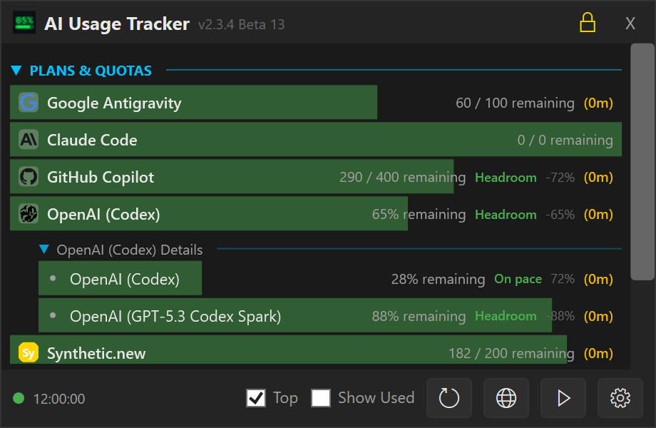 | **Default** | Factory defaults: PaceBadge, UsageRate, StatusText, ResetAbsolute. Pace-aware colours on, background bar on. |
| 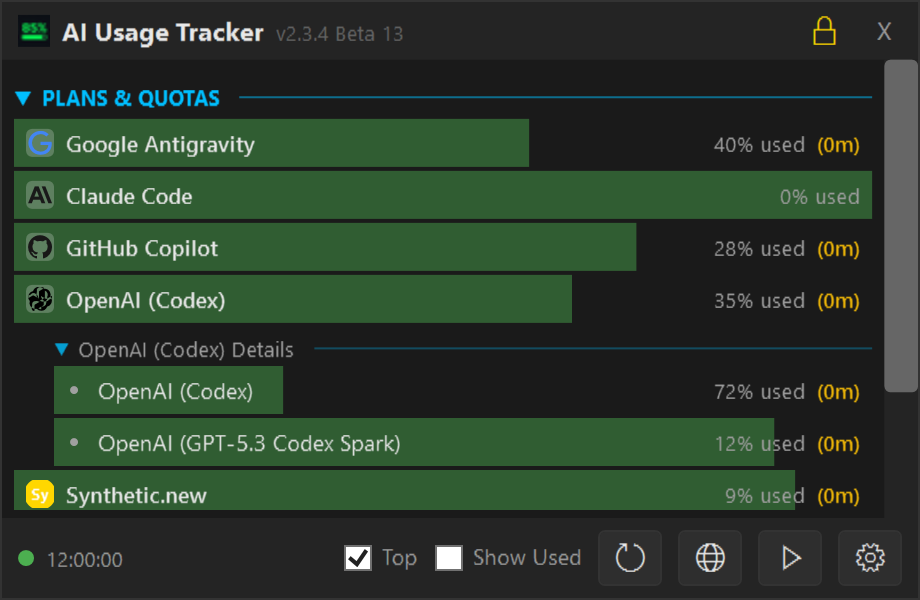 | **Preset: Compact** | Minimal layout: UsedPercent badge only, no secondary info, no status line. ResetAbsolute for reset time. |
|  | **Preset: Detailed** | Full information: PaceBadge, UsageRate, StatusText, ResetAbsolute. |
| 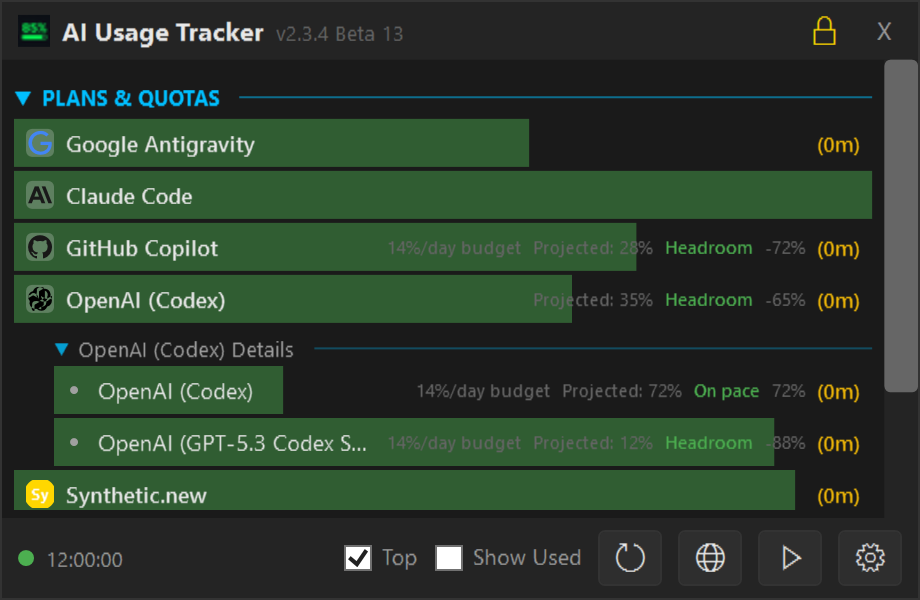 | **Preset: Pace Focus** | Pace-centred: PaceBadge, ProjectedPercent at end of period, DailyBudget, ResetAbsolute. |
| 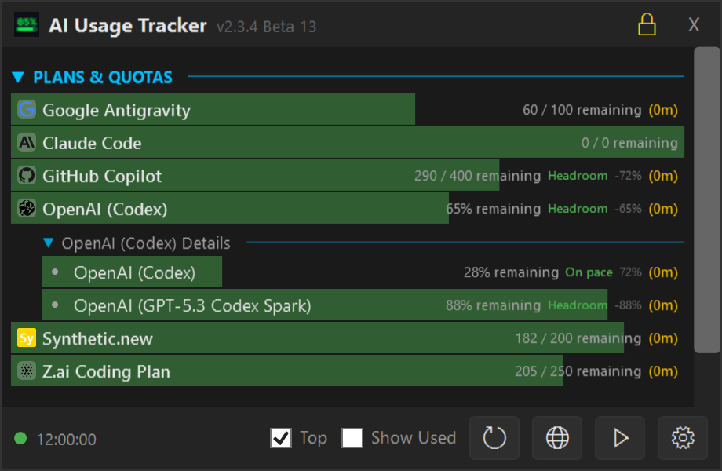 | **Compact Mode** | Reduced card height (20px instead of 24px), tighter margins and smaller fonts. |
| 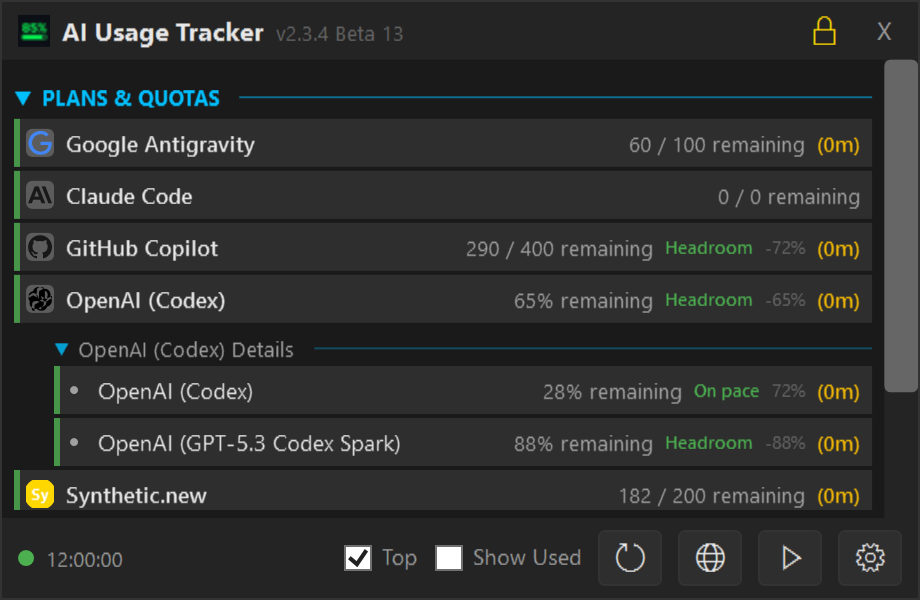 | **Background Bar Off** | Progress bar replaced by a thin 3px colour stripe on the left edge of each card. |
| 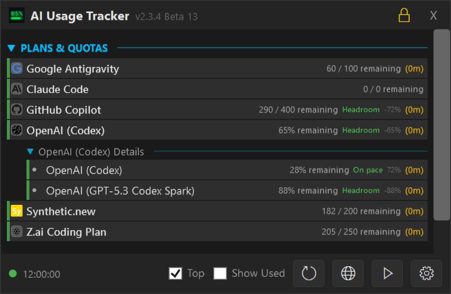 | **Compact + No Background Bar** | Compact mode combined with colour stripe. Most minimal card appearance. |
| 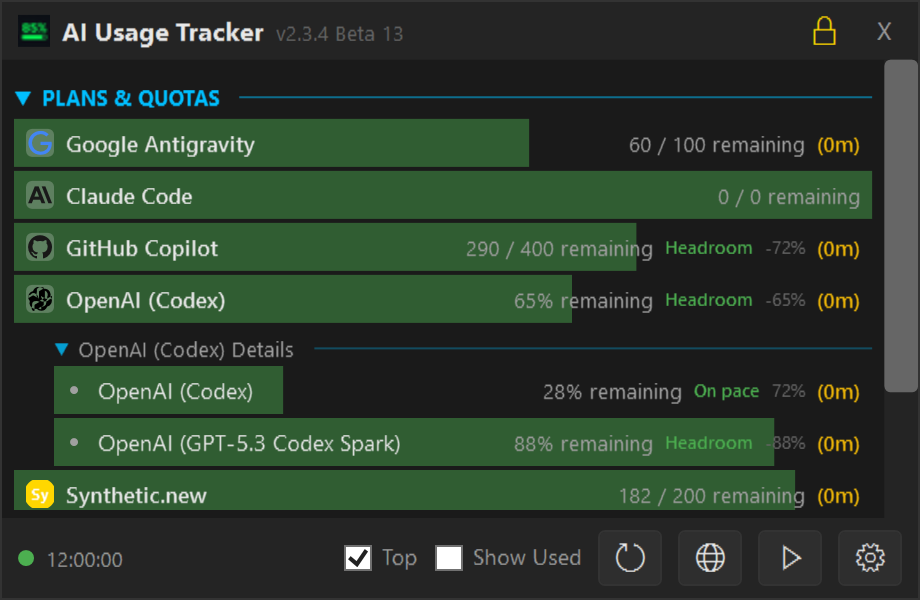 | **Dual Quota Bars** | Providers with burst + rolling windows show two stacked progress bars. Top bar = burst (5h), bottom bar = rolling (weekly). |
|  | **Dual Bars Off (Rolling)** | Dual bars disabled, single bar shows the rolling (weekly) window. |
|  | **Dual Bars Off (Burst)** | Dual bars disabled, single bar shows the burst (5-hour) window. |
| 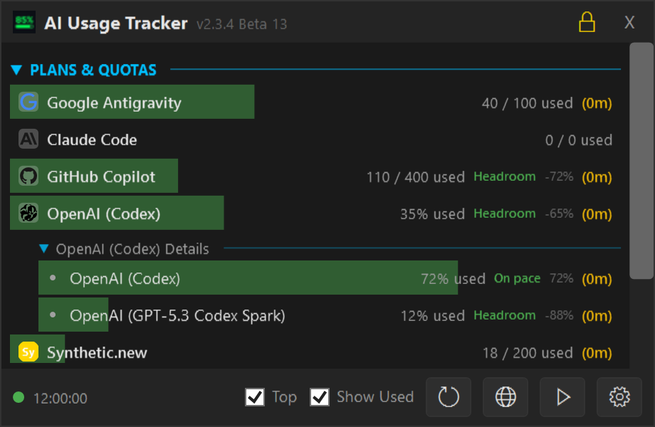 | **Show Used Percentages** | Displays "45% used" instead of "55% remaining". Progress bars fill from left (used) instead of depleting from right. |
| 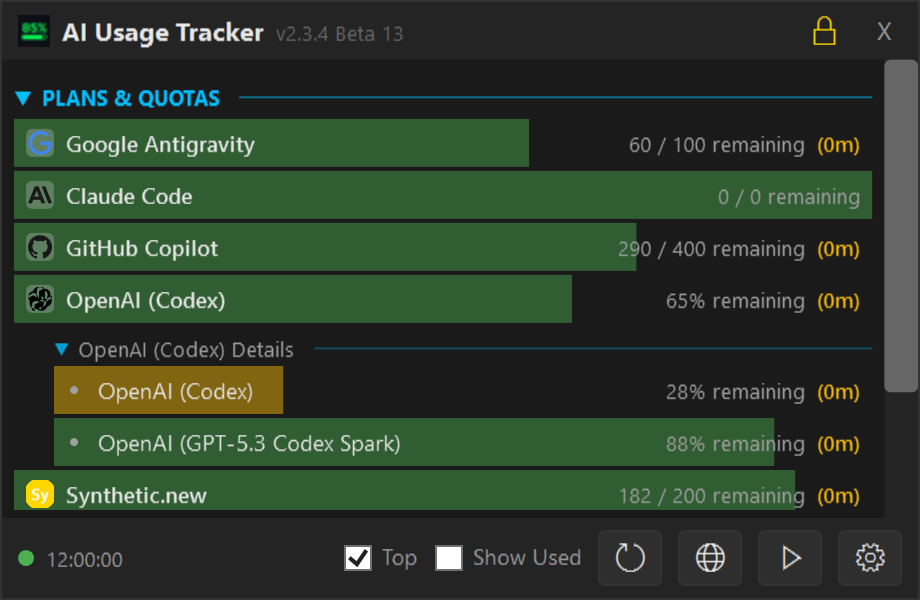 | **Pace Adjustment Off** | Bar colour based on raw usage percentage. No projection to end of period. A provider at 30% used always shows green, even if only 1 hour remains. |
|  | **Relative Reset Time** | Reset time shown as a countdown ("in 4h 23m") instead of an absolute timestamp. |
| 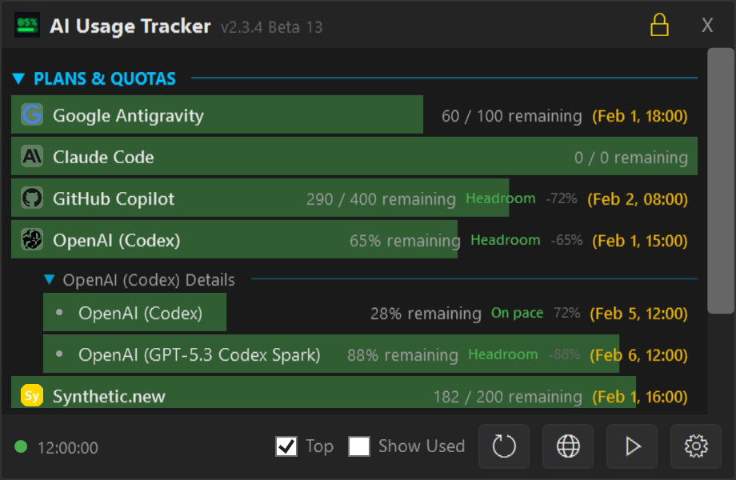 | **Reset Date Only** | Reset info slot shows the date portion only (no time). |
| 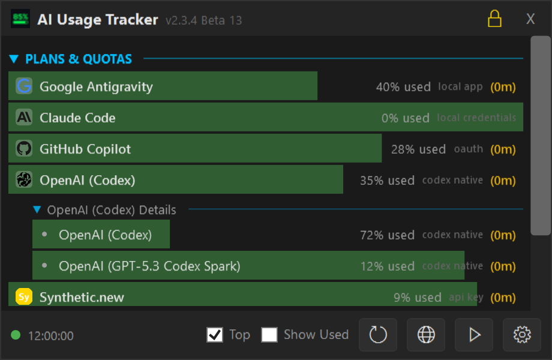 | **Slots: Account + Auth Source** | Primary badge shows account name (privacy-masked), secondary shows auth source. |
| 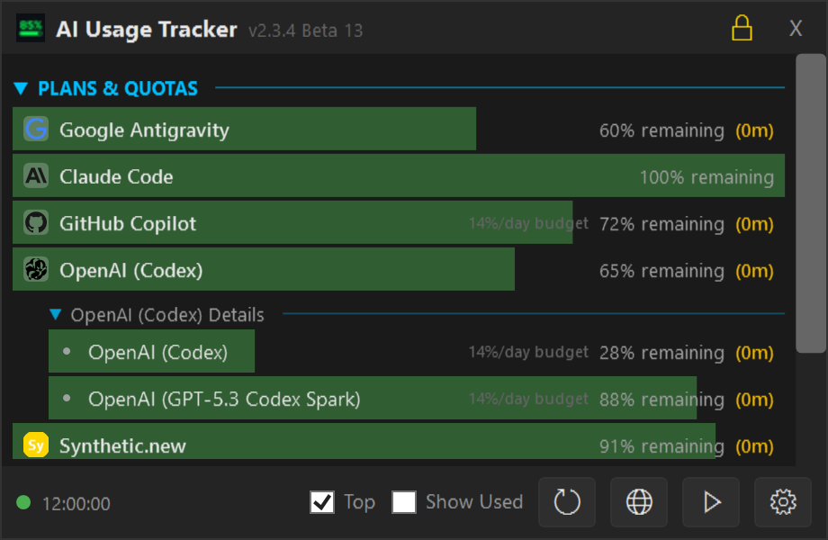 | **Slots: Remaining + Daily Budget** | Shows remaining percentage and daily budget (how many requests per day to stay on pace). |

---

## Permutation Details

### Default

Factory defaults: PaceBadge, UsageRate, StatusText, ResetAbsolute. Pace-aware colours on, background bar on.

### Preset: Compact

Minimal layout: UsedPercent badge only, no secondary info, no status line. ResetAbsolute for reset time.

### Preset: Detailed

Full information: PaceBadge, UsageRate, StatusText, ResetAbsolute.

### Preset: Pace Focus

Pace-centred: PaceBadge, ProjectedPercent at end of period, DailyBudget, ResetAbsolute.

### Compact Mode

Reduced card height (20px instead of 24px), tighter margins and smaller fonts.

### Background Bar Off

Progress bar replaced by a thin 3px colour stripe on the left edge of each card.

### Compact + No Background Bar

Compact mode combined with colour stripe. Most minimal card appearance.

### Dual Quota Bars

Providers with burst + rolling windows show two stacked progress bars. Top bar = burst (5h), bottom bar = rolling (weekly).

### Dual Bars Off (Rolling)

Dual bars disabled, single bar shows the rolling (weekly) window.

### Dual Bars Off (Burst)

Dual bars disabled, single bar shows the burst (5-hour) window.

### Show Used Percentages

Displays "45% used" instead of "55% remaining". Progress bars fill from left (used) instead of depleting from right.

### Pace Adjustment Off

Bar colour based on raw usage percentage. No projection to end of period. A provider at 30% used always shows green, even if only 1 hour remains.

### Relative Reset Time

Reset time shown as a countdown ("in 4h 23m") instead of an absolute timestamp.

### Reset Date Only

Reset info slot shows the date portion only (no time).

### Slots: Account + Auth Source

Primary badge shows account name (privacy-masked), secondary shows auth source.

### Slots: Remaining + Daily Budget

Shows remaining percentage and daily budget (how many requests per day to stay on pace).

