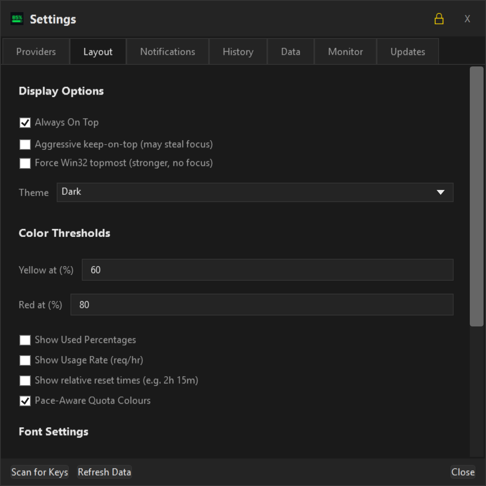
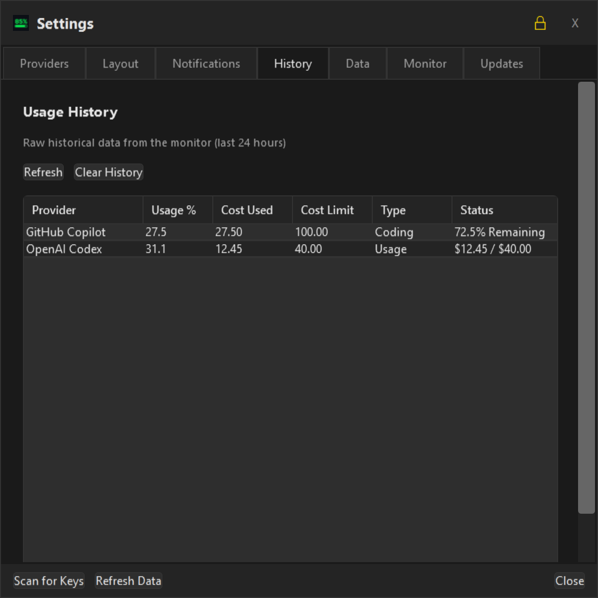
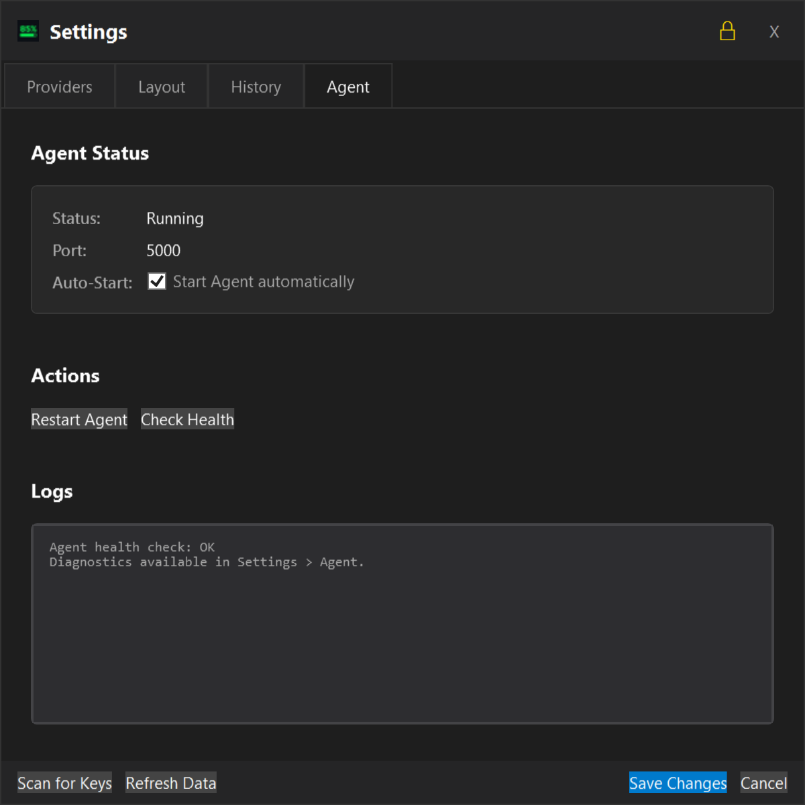
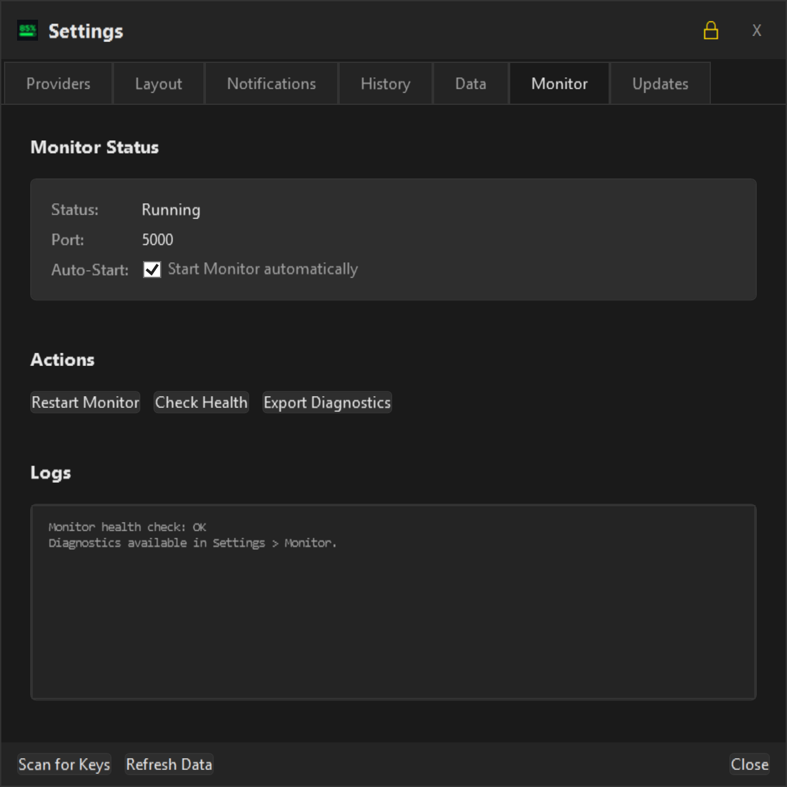
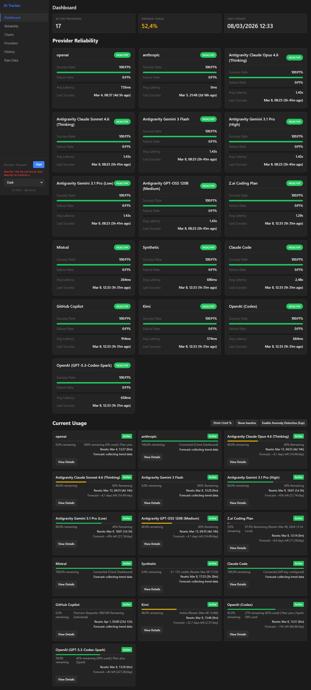
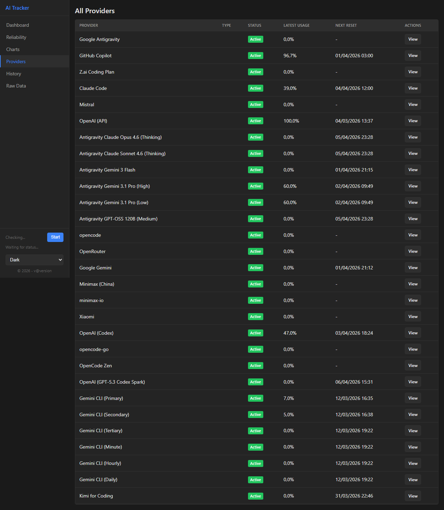
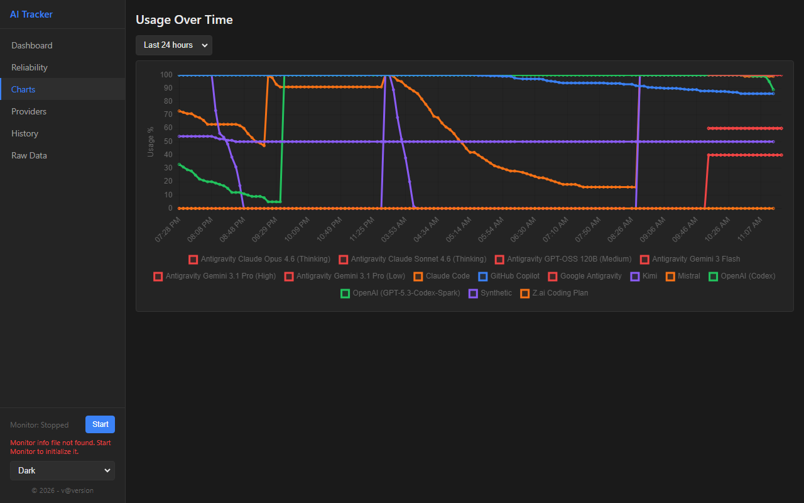

# AI Consumption Tracker - User Manual

Welcome to the **AI Consumption Tracker** user manual. This guide covers the Slim desktop UI pages, Web UI pages, and the command-line interface (`act`) so you can monitor and manage provider usage quickly.

## Concise Feature List

- Unified provider dashboard across Slim UI, Web UI, and CLI.
- Real-time usage/quota refresh with tray-friendly compact monitoring.
- Provider-level and global Windows notification controls (threshold + quiet hours + test action).
- Theme system with shared Slim/Web catalog and persistent preferences.
- Built-in key discovery from environment variables and common local auth/config files.
- Historical charts, raw usage views, and export options for troubleshooting.

## Auto-Generated Screenshots

The screenshots in this document are generated from the app's deterministic headless screenshot flow used by CI/CD, so the visuals stay aligned with current UI behavior.

- Dashboard: `docs/screenshot_dashboard_privacy.png`
- Settings (Overview): `docs/screenshot_settings_privacy.png`
- Settings > Providers: `docs/screenshot_settings_providers_privacy.png`
- Settings > Layout: `docs/screenshot_settings_layout_privacy.png`
- Settings > History: `docs/screenshot_settings_history_privacy.png`
- Settings > Monitor: `docs/screenshot_settings_agent_privacy.png`
- Settings > Monitor: `docs/screenshot_settings_monitor_privacy.png`
- Info dialog: `docs/screenshot_info_privacy.png`
- Tray context menu: `docs/screenshot_context_menu_privacy.png`
- Web Dashboard: `docs/screenshot_web_dashboard.png`
- Web Providers: `docs/screenshot_web_providers.png`
- Web Charts: `docs/screenshot_web_charts.png`

---

## 1. Slim UI Pages

### Main Dashboard Page


The main dashboard provides a real-time overview of your AI usage across various providers. It is designed to be lightweight and stay out of your way.

### Top Bar & Window Controls
- **Draggable Header**: Move the window by clicking and dragging the top dark bar.
- **Close (X)**: Closes the window. The app continues running in the system tray.

### Dashboard Controls (Footer)
- **Show All**: When disabled, only providers with active usage are shown.
- **Always on Top**: Keeps the dashboard above all other windows.
- **Stay Open (Pin)**: If unpinned, the window hides when it loses focus.
- **Compact View**: Condensed layout for minimal screen space.
- **Privacy Mode (🔒)**: Masks sensitive information like names and token counts.
- **Refresh (🔄)**: Immediate update of all provider data.

### Tray Context Menu


Right-clicking the tray icon opens quick actions for:
- show/hide dashboard
- open settings
- manual refresh
- exit the app

### Info Dialog


The Info dialog shows application/version details and helpful links for troubleshooting and configuration paths.

---

## 2. Settings & Configuration

The **Settings** window (⚙️ icon) is where you manage your AI providers and application preferences.


### Providers Tab


Configure API keys for OpenAI, Anthropic, Gemini, etc.
- **Tray**: Add a dedicated system tray icon for a specific provider.
- **Notify**: Enable Windows notifications for that provider's quota events.
- **Scan for Keys**: Automatically discover keys from environment variables and other apps (VS Code, GitHub, Claude Code, Roo Code).

### Layout Tab



- **Auto Refresh (Minutes)**: How often the app refreshes in the background (0 = Disabled).
- **Invert Progress Bars**: represent **Remaining** capacity (Default) or **Used** capacity.
- **Font Settings**: Customize font family, size, and style for the dashboard.

### Notifications Tab

- **Enable Windows notifications**: Global on/off switch.
- **Notify at (%)**: Threshold for usage alerts.
- **Event toggles**: Usage threshold and quota reset/exceeded events.
- **Quiet hours**: Suppress notifications in a configured time range.
- **Send Test Notification**: Verify end-to-end notification delivery.

### History Tab



Shows recent usage snapshots and provider history in one place for quick troubleshooting and trend checks.

### Agent Tab



Shows Agent status/connection details and controls related to local data collection service behavior.

### Monitor Tab



Contains monitor-specific options for background refresh behavior and integration settings.

### Data Export
Click the **"Export Data"** button in Settings to save your usage history as **CSV** or **JSON**.

---

## 3. Web UI Pages

The Web UI provides a browser-based view over Agent-collected data.

### Web Dashboard



High-level provider status cards, quotas/usage summaries, and periodic auto-refresh.

### Web Providers



Tabular provider listing with availability and current usage details.

### Web Charts



Historical charts with server-side downsampling for fast rendering over longer date ranges.

---

## 4. Command Line Interface (`act`)

The `act` command allows you to manage everything from your terminal. It communicates with the background Agent service.

### Basic Syntax
```bash
act <command> [options]
```

### Core Commands

| Command | Description | Options |
|:---|:---|:---|
| `status` | Show current usage table | `--all`, `--json` |
| `history` | Show recent usage history | `[days]` (default 7), `--json` |
| `list` | List configured providers | `--json` |
| `check` | Test provider connections | `[provider-id]` (optional) |
| `export` | Export history to file | `--format <csv/json>`, `--days <N>`, `--output <file>` |
| `scan` | Discover keys automatically | |
| `set-key` | Add/Update an API key | `<provider-id> <api-key>` |
| `remove-key` | Remove a provider key | `<provider-id>` |
| `config` | Manage preferences | `[key] [value]` |
| `monitor` | Manage background service | `start`, `stop`, `restart`, `info` |

#### Examples
- **Check connection** to all providers: `act check`
- **Export last 30 days** to JSON: `act export --format json --days 30 --output my_data.json`
- **Change threshold** via CLI: `act config NotificationThreshold 85`
- **View raw JSON** status: `act status --json`

---

## 5. System Notifications

The application uses native Windows 11 notifications to alert you about critical usage changes.

### Triggered Events
- **High Usage**: When a provider exceeds your configured threshold (e.g., >90%).
- **Quota Depleted**: When usage hits 100% or credits reach $0.00.
- **Reset/Refill**: When a quota is reset (e.g., at the start of a new billing cycle).

### Configuration
1. Enable **Notifications** globally in the **Notifications** tab.
2. Set your desired **Usage Threshold** (Default 90%).
3. (Optional) Disable individual providers by unchecking **"Notify"** in the **Providers** tab.

---

## 6. API Key Discovery

The application automatically searches multiple locations to save you time.

### Supported Discovery Sources
### Discovery Sources & Paths

#### Environment Variables
The application searches for the following variables in your system:

| Provider | Environment Variable | Alternate Variable |
|:---|:---|:---|
| **Anthropic** | `ANTHROPIC_API_KEY` | `CLAUDE_API_KEY` |
| **OpenAI** | `OPENAI_API_KEY` | |
| **Minimax** | `MINIMAX_API_KEY` | |
| **Kimi** | `KIMI_API_KEY` | `MOONSHOT_API_KEY` |
| **Xiaomi** | `XIAOMI_API_KEY` | `MIMO_API_KEY` |
| **OpenRouter** | `OPENROUTER_API_KEY` | |

#### Scanned File Paths
Keys are also discovered from these standard locations:

| Source | File Path / Location |
|:---|:---|
| **OpenCode** | `%APPDATA%\opencode\auth.json` |
| | `%LOCALAPPDATA%\opencode\auth.json` |
| | `~/.local/share/opencode/auth.json` |
| | `~/.config/opencode/auth.json` |
| **Kilo Code** | `~/.kilocode/secrets.json` |
| | `~/.kilocode/cli/config.json` |
| **Roo Code** | Windows: `%APPDATA%/Code/User/globalStorage/roovetgit.roo-code/` |
| | macOS: `~/Library/Application Support/Code/User/globalStorage/roovetgit.roo-code/` |
| | Linux: `~/.config/Code/User/globalStorage/roovetgit.roo-code/` |
| | `~/.roo/secrets.json` |
#### Native Authentication
For certain providers, the application provides a built-in login workflow that doesn't require discovery or manual key entry:

- **GitHub Copilot**: You can log in directly via the **Settings > Providers** tab. Click **"Log in"** to initiate a standard GitHub device authentication flow. This is our recommended way to connect if you don't use the GitHub CLI.
- **Google Antigravity**: Automatically detected if the monitor is running on your machine. No configuration required.

Click **"Scan for Keys"** in Settings or run `act scan` to trigger discovery from external sources.

---

## 7. Troubleshooting

- **Monitor not running**: The CLI will attempt to auto-start the monitor. If it fails, run `act monitor start` or start the UI application.
- **Missing Keys**: Use `act check` to see which providers are failing due to missing or invalid keys.
- **Data Refresh**: If the UI feels stale, check the **Auto Refresh** setting or click the 🔄 button.

---

*Version: 2.2.5 | Author: Alexander Brandt*

