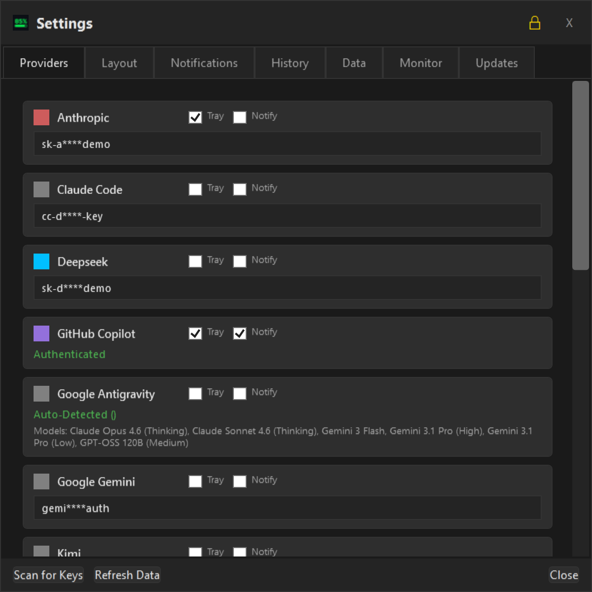
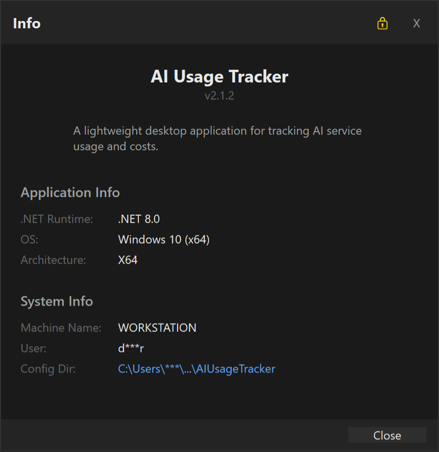
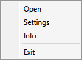

# AI Consumption Tracker - User Manual

Welcome to the **AI Consumption Tracker** user manual. This guide will help you understand the features of the graphical user interface and how to manage your AI provider consumption effectively.

## Dashboard Overview

The main dashboard provides a real-time overview of your AI usage across various providers. It is designed to be lightweight, stay out of your way, and provide at-a-glance information.

### Top Bar & Window Controls
- **Draggable Header**: You can move the window by clicking and dragging the top dark bar.
- **Close (X)**: Closes the dashboard window. The application continues running in the system tray if configured.

---

## User Interface Features

The footer of the dashboard contains several toggles and buttons to customize your experience:

### 1. Show All
- **Toggle**: Filters the list of providers.
- **Behavior**: When enabled, all configured providers are shown. When disabled, only providers with active usage or specific alerts are displayed, keeping your list clean and focused.

### 2. Top (Always on Top)
- **Toggle**: Controls window layering.
- **Behavior**: When checked, the dashboard will stay above all other windows, ensuring your consumption data is always visible while you work.

### 3. Pin (Stay Open)
- **Toggle**: Controls auto-hide behavior.
- **Behavior**: 
    - **Pinned**: The window remains open until you manually close it.
    - **Unpinned**: The window will automatically hide when it loses focus (e.g., when you click into another application), making it perfect for quick checks.

### 4. Compact View
- **Toggle**: Adjusts the layout density.
- **Behavior**: When enabled, the UI uses a more condensed layout with smaller fonts and tighter spacing, ideal for keeping the window small on your screen.

### 5. Refresh (🔄 Icon)
- **Action**: Triggers an immediate update.
- **Behavior**: Fetches the latest usage data from all configured API providers.
- **Auto Refresh**: The app also performs periodic background refreshes. You can configure the interval (in minutes) in the **Layout** tab of the Settings window. Setting this to **0** disables automatic background refreshing.

### 6. Settings (⚙️ Icon)
- **Action**: Opens the **Provider Settings** window.
- **Features**:
    - **API Keys**: Configure your keys for OpenAI, Anthropic, Gemini, etc.
    - **Tray Icon**: Check the "Tray" checkbox next to any provider to add a dedicated system tray icon for that provider.
    - **Notifications**: Check the "Notify" checkbox to receive Windows notifications when that provider's quota is depleted or refreshed.
    - **Layout Tab**:
        - **Auto Refresh (Minutes)**: Configure how often the app refreshes in the background (Default: 5).
        - **Privacy Mode**: Toggle to mask sensitive information like account names and specific token counts.
        - **Scan for Keys**: Automatically searches your environment variables and files for existing AI API keys to speed up setup.
        - **Save/Cancel**: Apply your changes or discard them without saving.
        - **Recent Changes (v1.7.4)**:
            - Privacy mode is now only accessible via the dashboard footer button (Settings dialog duplicate removed)
            - Fixed bug where privacy toggle didn't update the UI display
            - Enhanced code quality with `.editorconfig` and Roslyn analyzer rules



### 7. Info Dialog
- **Action**: Accessible via the Settings menu or right-click.
- **Content**: Displays version information, credits, and links to the project repository.



### 8. Tray Context Menu
- **Access**: Right-click the application icon in the system tray.
- **Features**: Quick access to the Dashboard, Settings, Info, and Exit.



### 9. Tray Status Icons
The application uses dynamic tray icons to show usage levels at a glance:
- **Green**: Low usage
- **Yellow**: Medium usage (approaching threshold)
- **Red**: High usage (exceeding threshold)
 
  

### 6. Antigravity Offline Support
- **Caching**: The application now caches Antigravity usage data when the application is running successfully.
- **Offline Display**: When Antigravity is not running, the tracker shows cached usage data with a "Last refreshed: Xm ago" countdown timer.
- **Reset Information**: If reset times are available in cached data, the tracker displays "Resets in Xh Ym" to show when quota will be refilled.
- **Behavior**: This ensures you can monitor Antigravity usage even when the application is closed, with clear indication of data staleness and upcoming quota resets.

### 10. Invert Progress Bars (Health Bar Mode)
- **Setting**: Found in the main dashboard or settings.
- **Behavior**: 
    - **Enabled (Default)**: Bars represent **Remaining** capacity (Start Full/Green -> End Empty/Red).
    - **Disabled**: Bars represent **Used** capacity (Start Empty -> End Full/Red).
- **Logic**: Colors are standardized based on usage level (Red for >80% usage) regardless of the display mode.

### 6. Antigravity Offline Support
- **Caching**: The application now caches Antigravity usage data when the application is running successfully.
- **Offline Display**: When Antigravity is not running, the tracker shows cached usage data with a "Last refreshed: Xm ago" countdown timer.
- **Reset Information**: If reset times are available in cached data, the tracker displays "Resets in Xh Ym" to show when quota will be refilled.
- **Behavior**: This ensures you can monitor Antigravity usage even when the application is closed, with clear indication of data staleness and upcoming quota resets.

### 10. Invert Progress Bars (Health Bar Mode)
- **Setting**: Found in the main dashboard or settings.

> **Note**: For detailed information on setting up environment variables for automatic discovery, see [Environment Variables Guide](environment_variables.md).

**OpenAI Users**: You can also authenticate via JWT tokens by running `opencode-tracker auth openai` in the OpenCode CLI. This provides actual usage data and credit balance from the ChatGPT backend API.

---

## API Key Discovery

AI Consumption Tracker automatically discovers API keys from multiple sources, eliminating the need to manually copy and paste keys into the application. When you click **"Scan for Keys"** in the Settings dialog, the application searches all of the following sources.

### Discovery Sources Overview

| Source | Providers | Method |
|:-------|:----------|:-------|
| **OpenCode** | All configured providers | Config files in standard locations |
| **Kilo Code** | Kilo Code + Roo Cline providers | VS Code extension and CLI config |
| **Roo Code** | Multiple providers via Roo Cline | VS Code extension storage |
| **Environment Variables** | Anthropic, OpenAI, Minimax, Kimi, Xiaomi, OpenRouter | System environment |
| **GitHub CLI** | GitHub Copilot | `gh auth token` command |
| **Claude Code** | Anthropic (Claude) | `~/.claude/.credentials.json` |

### OpenCode Integration

OpenCode is a CLI tool that stores API keys in configuration files. The application searches for these files in multiple standard locations:

**Config File Locations:**
- Windows: `%APPDATA%\opencode\auth.json`
- Windows: `%LOCALAPPDATA%\opencode\auth.json`
- Linux/macOS: `~/.local/share/opencode/auth.json`
- Linux/macOS: `~/.config/opencode/auth.json`
- Cross-platform: `~/.opencode/auth.json`

**What Gets Discovered:**
- All providers configured in your OpenCode auth.json
- API keys for any provider you've added via `opencode auth <provider>`

### Kilo Code Integration

Kilo Code is an AI coding assistant that stores configuration in your home directory. The application discovers keys from:

**Sources:**
1. **VS Code Extension** (`~/.kilocode/secrets.json`):
   - Direct Kilo Code authentication token
   - Roo Cline configuration with API keys for multiple providers

2. **CLI Config** (`~/.kilocode/cli/config.json`):
   - Kilo Code tokens from the providers array
   - CLI-specific authentication

**Roo Cline Integration:**
If you use Roo Cline within Kilo Code, the application extracts API keys from the nested configuration, including:
- Anthropic (Claude)
- OpenAI
- Gemini
- OpenRouter
- Mistral

### Roo Code Integration

Roo Code is an AI coding extension for VS Code that uses the Roo Cline configuration system. The application discovers API keys from:

**Sources:**
1. **VS Code Extension Storage** (VS Code globalStorage):
   - Windows: `%APPDATA%/Code/User/globalStorage/roovetgit.roo-code/`
   - macOS: `~/Library/Application Support/Code/User/globalStorage/roovetgit.roo-code/`
   - Linux: `~/.config/Code/User/globalStorage/roovetgit.roo-code/`

2. **Standalone Config** (`~/.roo/secrets.json`):
   - Direct Roo Code configuration file
   - API configurations for multiple providers

**What Gets Discovered:**
- Anthropic (Claude) API keys
- OpenAI API keys
- Gemini API keys
- OpenRouter API keys
- Mistral API keys

**Note:** Roo Code and Roo Cline use the same configuration format, so API keys discovered from Roo Code are available for the respective providers in AI Consumption Tracker.

### Environment Variables

The application searches for provider-specific API keys in your environment:

| Variable | Provider |
|:---------|:---------|
| **ANTHROPIC_API_KEY** / **CLAUDE_API_KEY** | Anthropic (Claude) |
| **OPENAI_API_KEY** | OpenAI / Codex |
| **MINIMAX_API_KEY** | Minimax |
| **KIMI_API_KEY** / **MOONSHOT_API_KEY** | Kimi (Moonshot) |
| **XIAOMI_API_KEY** / **MIMO_API_KEY** | Xiaomi |
| **OPENROUTER_API_KEY** | OpenRouter |

**Setting Environment Variables:**

Windows (PowerShell):
```powershell
[Environment]::SetEnvironmentVariable("ANTHROPIC_API_KEY", "your-key-here", "User")
```

Windows (Command Prompt):
```cmd
setx ANTHROPIC_API_KEY "your-key-here"
```

Linux/macOS:
```bash
export ANTHROPIC_API_KEY="your-key-here"
```

### GitHub CLI Integration

If you have the GitHub CLI (`gh`) installed and authenticated, the application can automatically retrieve your GitHub Copilot token:

**How it works:**
- Runs `gh auth token` command
- No manual configuration required
- Token is stored securely by GitHub CLI

**Requirements:**
- GitHub CLI must be installed
- You must be logged in (`gh auth login`)

### Claude Code Integration

For Claude Code users, the application reads OAuth tokens from:

**Location:** `~/.claude/.credentials.json`

**What Gets Discovered:**
- Access token from `claudeAiOauth.accessToken`
- Automatic authentication for Anthropic/Claude provider

### Security Considerations

- **Read-Only**: The application reads configuration files but never writes to them
- **Local Storage**: Discovered keys are cached locally in the application's secure storage
- **Source Tracking**: Each key shows its discovery source (e.g., "Env: ANTHROPIC_API_KEY", "Kilo Code Secrets", "Claude Code Credentials")
- **No Cloud**: Your API keys never leave your local machine

### Troubleshooting Discovery

**Keys Not Found?**
1. Ensure the source application (OpenCode, Kilo Code, etc.) is configured
2. Check that files are in the expected locations
3. Verify environment variables are set at the user level (not just session)
4. Restart AI Consumption Tracker after making changes
5. Click **"Scan for Keys"** in Settings to trigger a fresh search

**Duplicate Keys?**
If the same key is discovered from multiple sources, the application uses the first one found and displays the source. You can manually edit keys in Settings if needed.

---

## Windows Notifications

AI Consumption Tracker supports Windows 11 native notifications (toast notifications) to alert you about important quota events.

### Notification Types

The application can send notifications for:

1. **Quota Depletion** - When a provider's quota reaches 100% or credits drop to 0
   - Title: "🔴 [Provider] Quota Exceeded"
   - Message: "Quota depleted at 100.0% usage"

2. **Quota Refresh** - When a depleted quota becomes available again after reset
   - Title: "✅ [Provider] Quota Refreshed"
   - Message: "Your quota has been reset. You now have X USD available."

### Enabling Notifications

To enable notifications for a provider:
1. Open **Settings** (⚙️ icon on dashboard or right-click tray icon)
2. Find the provider in the list
3. Check the **"Notify"** checkbox next to the provider name
4. Click **Save**

### Disabling Notifications

To disable notifications for a provider:
1. Open **Settings**
2. Find the provider in the list
3. Uncheck the **"Notify"** checkbox
4. Click **Save**

### Global Notification Switch

To disable **all** notifications at once:
1. Open **Settings**
2. Go to the **Layout** tab
3. Uncheck **"Enable Windows notifications for quota events"**
4. Click **Save**

This global switch overrides all per-provider settings. When disabled, no notifications will be shown regardless of individual provider settings.

### Notification Behavior

- **Smart Detection**: Notifications are only sent once per state change (no spam)
- **Click Action**: Clicking a notification opens the dashboard
- **Action Center**: Notifications appear in Windows Action Center until dismissed
- **Per-Provider Control**: Each provider can have notifications enabled/disabled independently (when global switch is on)
- **Global Override**: The global switch in Layout settings disables all notifications when turned off

---

## System Tray Integration
The application runs primarily in the system tray (near the clock). You can right-click the icon to:
- Open the Dashboard.
- Open Settings directly.
- Exit the application completely.

